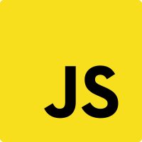

<h1 align="center">
    
</h1>

<h3 align="center">
  JS Rocketseat :book:
</h3>

 Repositório desenvolvido durante o curso de Javascript, contendo exemplos e exercícios de cada módulo. <a href="https://skylab.rocketseat.com.br/journey/starter">JavaScript Starter</a> 🎓

